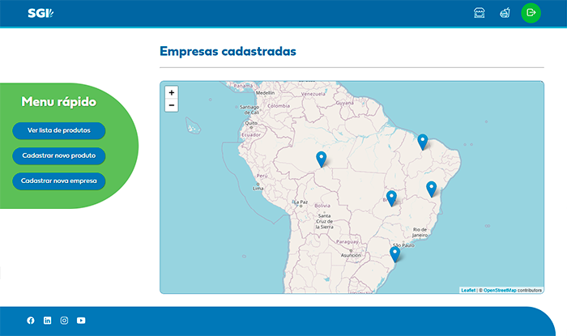

## Veja a preview: https://sgi-paripassu.netlify.app/
Para acessar a tela de login: inserir um e-mail qualquer e o mínimo de 6 caracteres como senha.
## Assista ao [vídeo do desenvolvimento](https://www.linkedin.com/posts/amaralcamilla_devinhouse-senai-frontend-activity-6868653965689679872-8g4s).

 

# Projeto #2 DEVinHouse - Módulo Front-end

Você está prestes a entrar para o time de Desenvolvedores da DEVin Corp. Para concretizar a sua contratação, você deverá resolver um desafio utilizando React. O time de recrutamento necessita que você crie uma aplicação protótipo para o gerenciamento de empresas e produtos, chamada Sistema de Gestão Integrada - SGI.

## Requisitos da Aplicação
A aplicação que deverá ser realizada individualmente, deve contemplar os seguintes requisitos:
- Uma página de login contendo um campo de email e senha. No evento de onSubmit, validar se os campos foram preenchidos: E-Mail (obrigatório) e Senha (obrigatório). Ao validar os campos de input, o usuário é redirecionado para a tela de Mapa;
- Uma página de cadastro de nova empresa, contendo os campos: razão social, nome fantasia, cnpj, e-mail, cep, endereço, número, bairro, cidade, complemento, latitude e longitude; Todos os campos são obrigatório, exceto o campo complemento (validar no método onSubmit). Ao cadastrar uma nova empresa, mostrar uma mensagem de feedback de empresa cadastrada com sucesso (tratar o método onSubmit com Try/Catch).
-Uma página de cadastro de produto, contendo os campos url do produto, nome do produto, preço unitário, descrição (<textarea/>) , fornecedor do produto (<select />)  e grupo (<select />) .  Ao cadastrar um novo produto, mostrar uma mensagem de feedback de produto cadastrado com sucesso (tratar o método onSubmit com Try/Catch). As opções do select de grupo e fornecedor devem ser preenchidas de acordo com as rotas /categorias e /fornecedores
- Uma tela de mapa,  contendo um Mapa centralizado e com marcadores de todas as empresas cadastradas no sistema (usar a latitude e longitude da empresa para definir a localização no mapa). 
- Uma implementação extra por parte do aluno.

## Plano de Projeto
Ao construir a aplicação Sistema de gestão integrada - SGI  contendo as páginas de Mapa, Empresas, Produtos e login,  o aluno estará colocando em prática os aprendizados em:
- HTML: principais tags como head, title, body, div, h1, form, input, button, ul, li. Atributos de tags como class, id, type.
- CSS: estilizar a página, os botões, inputs, alterar atributos dos elementos da tela de acordo com a interação do usuário para uma melhor experiência do usuário (UX), Alinhamento de elementos com flex-box.
- Javascript: variáveis, arrays, funções .map(), .filter(), .reducer(),  manipulação de eventos onChange, onSubmit, json-server.
- React: Componentes funcionais, Props, useEffect, useState, Estado do componente, Componentes de terceiros (react-leaflet), validação de formulários, chamadas para API usando API Fetch.

